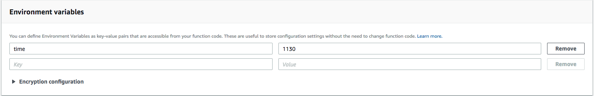
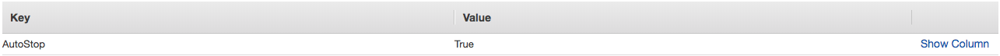

# Start Stop AWS

Turn off environments after a set time.

## Getting Started

deploy.sh

### Prerequisites

usual, AWSCLI, AWS IAM role, Terraform


### Installing

git clone this repo

## Deployment

uses the ```deploy.sh```

./deploy.sh plan   
./deploy.sh apply   

## Built With

AWS lambda, cloud watch events

## Notes

to set the time for shutdown look in playloads/autostop_ec2.py

```
# Poweroff time (24h format)
poweroff_time = 1800
```

or



uses UTC, remember BST also adds an hour..

Tags to set on instances that you want to turn off



## Contributing

pull requests welcome

## Versioning

0.1

## Authors

* **Darren Holdaway** - *Initial work*

and some randoms from the internet...

https://docs.aws.amazon.com/AmazonCloudWatch/latest/events/ScheduledEvents.html
https://medium.com/blogfoster-engineering/running-cron-jobs-on-aws-lambda-with-scheduled-events-e8fe38686e20
https://aws.amazon.com/blogs/aws/new-for-aws-lambda-environment-variables-and-serverless-application-model/
https://s3.amazonaws.com/solutions-reference/ec2-scheduler/latest/ec2-scheduler.pdf
